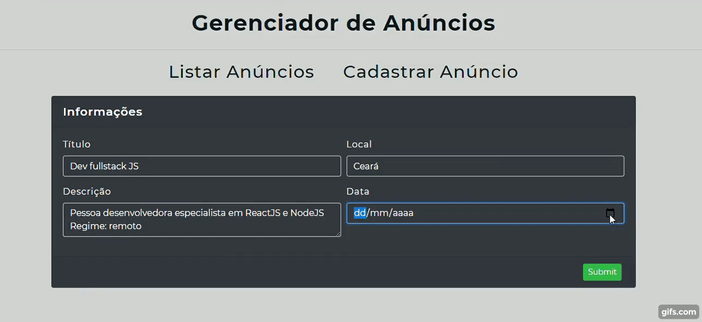

<h1 align="center">CRUD para gerenciador de anúncios</h1>

<h1>
  </img>
</h1>

## 🔖 Sobre
O projeto é uma plataforma web para gerenciamento de anúncios, totalmente funcional e pronta para implementação.

## 🛠 Tecnologias utilizadas
O projeto foi desenvolvido usando as seguintes tecnologias:

- [ReactJS](https://reactjs.org)
- [Bootstrap](https://getbootstrap.com/)
- [Axios](https://axios-http.com/docs/intro)

## 📦 Como baixar o projeto
```bash

  # Clonar repositório
  $ git clone https://github.com/samuelfcf/frontendAnuncioAPI

  # Entrar no diretório
  $ cd crudanuncios

  # Instalar dependências
  $ yarn install

  # Iniciar o projeto
  $ yarn start
```
---
Desenvolvido por Samuel Felipe Castro Fernandes